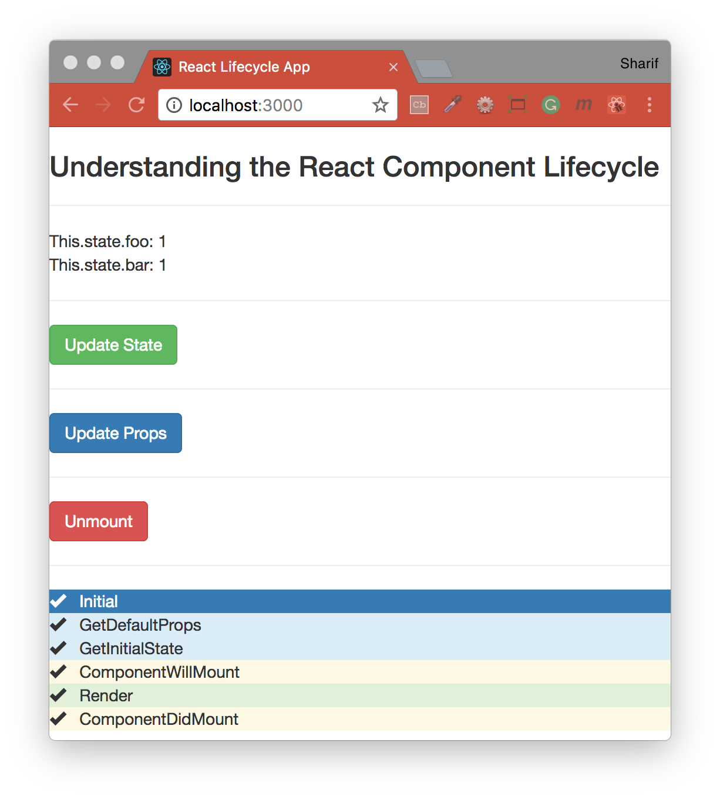

## Understanding the React Component Lifecycle
___Component Lifecycle in React___ code grabbed from "[Plunkr](https://plnkr.co/edit/0cN0tu?p=preview)."

___ReactJs component lifecycle methods — A deep dive___ artcile grabbed from "[HACKERnoon](https://hackernoon.com/reactjs-component-lifecycle-methods-a-deep-dive-38275d9d13c0)."


#### Installation
To run this project you will need to download it onto your local machine and install all dependencies.
Navigate inside the folder and install all dependencies by entering the following command on your terminal window:
```
npm install
```
Finally to run the server enter the following command in your terminal window:
```
npm start
```
This will run the server, open [http://localhost:3000](http://localhost:3000) to view it in the browser. If you make any changes and save the changes process will automatically refresh and you will be able to see the results in the browser.

If you want to end the process hold `control` and press `c` in mac, if you are not using mac hold `ctrl` and press `c`.

#### Built with
* [npm](https://www.npmjs.com/) - Node Package Manager
* [React](https://www.npmjs.com/package/react) - An npm package to get you immediate access to React
* [React DOM](https://www.npmjs.com/package/react-dom) - This package serves as the entry point of the DOM-related rendering paths
* [React Scripts](https://www.npmjs.com/package/react-scripts) - This package includes scripts and configuration used by Create React App
* [prop-types](https://www.npmjs.com/package/prop-types) - Runtime type checking for React props and similar objects.

#### Four phases of a React component


The React component, like anything else in the world, goes through the following phases
- <b>Initialization</b> - In this phase the React component prepares for the upcoming tough journey, by setting up the initial states and default props.
- <b>Mounting</b> - After preparing with basic needs, state and props, our React Component is ready to mount in the browser DOM. This phase gives hook methods for before and after mounting of components.
- <b>Updation</b> - This phase starts when the react component has taken birth on the browser and grows by receiving new updates. The component can be updated by two ways, sending new props or updating the state.
- <b>Unmounting</b> - In this phase, the component is not needed and the component will get unmounted from the DOM.